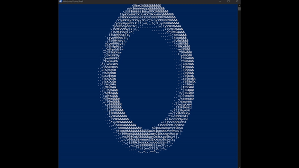
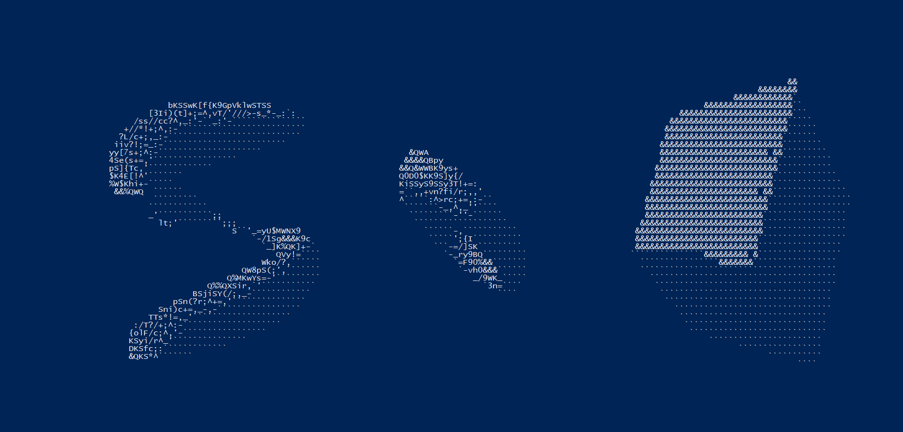
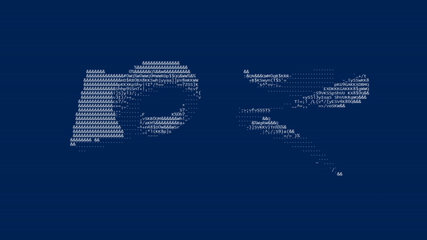
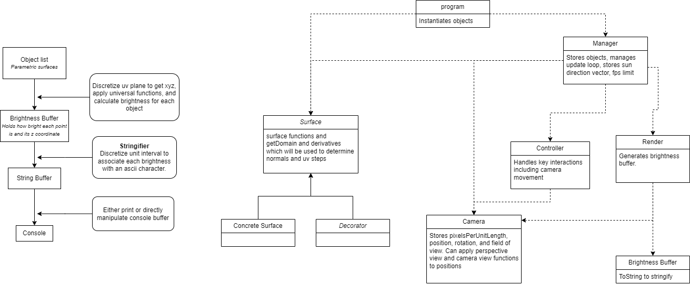
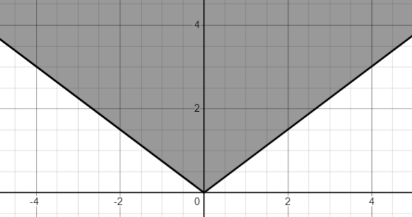
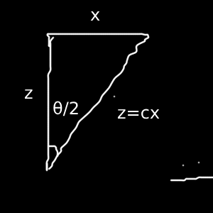

# ASCII Render Engine

The program takes a different approach to rendering 3D objects from the conventional approach of using rays from the camera, or whatever the conventional approach is. The way it works requires that every 3D object be described by a parametric surface equation. Refer to [Details](#details) for the juicy math. Refer to [Usage](#usage) to run the program or add in your own cool shapes.

## Features
### Spinning Donut
[Equation](https://www.desmos.com/3d/hlziur9zvc)



### Any Parametric Surface
[Equation for Swirly Thing](https://www.desmos.com/3d/x9zww0oxcp) (Not my equation)



### Perspective View
Objects get smaller as they get further away which causes effects such as in a hallway where the walls seem to get closer at far distances.


### Moveable Camera
Pressing various keys moves the camera and adjusts other environment settings. Press H while in the program to see all the keybinds.



### Backface culling
The back of surfaces are culled so that when you go inside an object you dont see its surface. Not much reason for this, just wanted to figure out how to do it.

## Usage
### Windows or Mac (using visual studio)
Install visual studio if not already installed

Run `AsciiRender.csproj` using visual studio.

Go to Debug -> Start Debugging

### Linux (using dotnet)
[Install dotnet](https://learn.microsoft.com/en-us/dotnet/core/install/linux)

Run the following inside the repository
```
dotnet run
```

### Adding Stuff

#### New Surface
Create a subclass of the Surface class and override each abstract method. The GetUSteps and GetVSteps methods determine how many parts to discretive the domain in the GetDomain function. These two methods may be removed in the future but for now, tinker with it until the object is rendered in full with no holes.

Two other methods require knowing how to take a derivative.

Look at `Plane.cs` for a simple example.

Once the subclass is complete. pass an instance into the surfaces array in `Program.cs` so that it is shown in the world.

#### Decorators
In order to move, rotate, or do any modular things to surfaces, decorators are used.

Examples of their use can be seen in `Program.cs` and to create a new ones requires subclassing the Decorator class.

## Details

### Simplified Class Diagram
This is the diagram I used to plan the project. It only includes the main classes.



The dashed lines indicate a has-a relationship with the arrowhead. The sold lines indicate an inheritance from the class at the arrowhead.

### Math

#### Drawing Shapes

Discretizing UV plane. computing brightness. Camera. Perspective View. Rotations

The domain of the parametric surface (a UV plane) is split into distrete steps. A loop iterates over these steps giving a (u, v) coordinate which gives a (x, y, z) coordinate by the surface equation where x and y are the screen coordinates and z is depth.

Now this pixel needs some brightness. The normal of the surface at a point can be found by taking the cross product with two lines tangent to the point. Let $\vec{r}(u, v)$ be a position function for the surface. Holding u constant at the point yields a line whose tangent is $\frac{\partial \vec{r}}{\partial v}$. Holding v constant yields $\frac{\partial \vec{r}}{\partial u}$. Thus the normal is $\frac{\partial \vec{r}}{\partial u} \times \frac{\partial \vec{r}}{\partial v}$.

The more a surface "points" towards the sun, the brighter it is. The normal is the direction the surface is pointing so a dot product between the sun vector and the unit normal vector yields a value between -1 and 1. Where 1 is looking directly at the sun and -1 is looking directly away. This value is used for brightness.

#### Camera

In reality, there is no camera, just shifting of the whole world. When the camera moves left, the world shifts to the right. Similarly, camera rotations apply an opposite rotation to the world about the origin.

The perspective view is a bit more complicated. The final equation can be found [here](https://www.desmos.com/geometry/rupqiij9no).

We want to achieve a view that looks like the following



On the y-axis is the depth, $z$, and on the x-axis is the original position, $x$. Everything in the highlighted area is a point to be included in our view. Essentially, the further away a point is --higher up the graph-- a wider range of x values is included in our view --we can see an entire building at a distance but only the wall when its in our face.

The equation for the graph is $c|x| \leq z$ where $c$ is some constant determining the slope of the lines. Changing $c$ changes the FOV.



Then we have $c = \cot(\frac{\theta}{2})$.

Rearranging $c|x| \leq z$ yields $\frac{|x|\cot(\frac{\theta}{2})}{z} \leq 1$. Now let $x_f$ be the actual output position on the screen and $w$ be the width of the screen. We could set $|x_f| = \frac{|x|\cot(\frac{\theta}{2})}{z}$ which gives $|x_f| \leq 1$ but that would mean we only see $x$ values from -1 to 1. We actually see values from $-w$ to $w$. so first obtain $\frac{w|x|\cot(\frac{\theta}{2})}{z} \leq w$. This gives us the final equation:

$x_f = \frac{w|x|\cot(\frac{\theta}{2})}{z}$